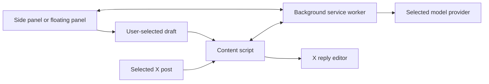

# Technical architecture

ReplyLoom is a Chrome Manifest V3 extension built with React, TypeScript, and
Vite. It connects directly to the user's selected model provider.

## Runtime components

- `src/content/`: selects and extracts post context, adds the AI reply trigger,
  hosts the floating panel, and inserts a chosen draft into X's reply editor.
- `src/background/`: coordinates extension messages, stores settings and selected
  post state, and calls supported provider APIs.
- `src/sidepanel/`: displays the source post, generation controls, editable
  candidates, and provider settings. The same page supports the floating panel.
- `src/shared/`: defines domain types and messages, builds prompts, and parses
  and normalizes candidates.

## Storage and permissions

`chrome.storage.local` holds provider profiles and interface preferences. API
keys are saved there only when the user enables persistence; otherwise they
are held in `chrome.storage.session`. Selected post context uses session storage.
Credentials are not stored in `chrome.storage.sync`.

The manifest requests `sidePanel`, `storage`, and `scripting`, with host access
to X. Provider host permissions are optional and requested for the selected
provider. The provider adapter validates HTTPS and an exact match with the
provider's configured official endpoint. Arbitrary custom API hosts are not
supported.

## Build and verification

`npm run check` checks version consistency, runs unit and DOM-fixture tests,
and type-checks and builds the extension. `npm run package` creates a ZIP from
`dist/`. See [manual testing](07-manual-testing.md) for browser checks.
